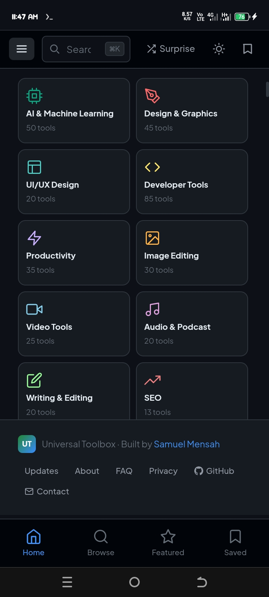
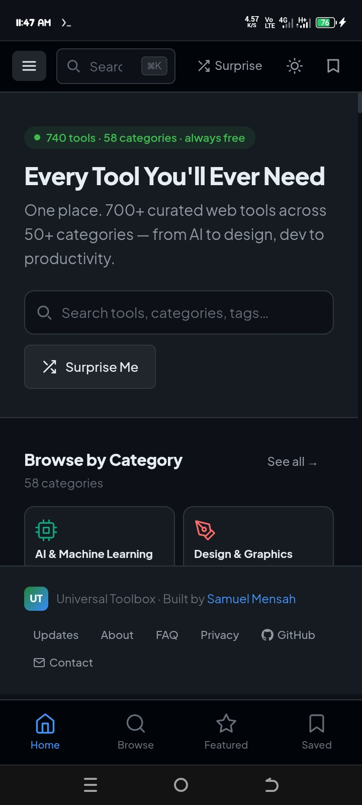
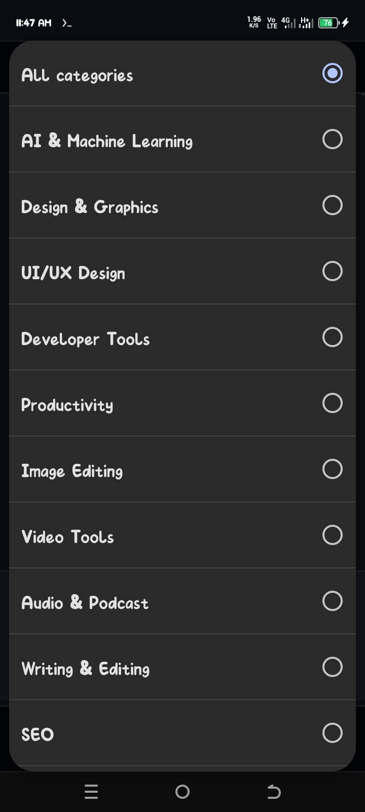

# Universal Toolbox 🛠️

<div align="center">

[](LICENSE)
[](https://reactjs.org/)
[](https://vitejs.dev/)
[](https://web.dev/progressive-web-apps/)
[](https://universal-toolbox.vercel.app/)

**Universal Toolbox** is a comprehensive, beautifully designed open-source workspace featuring **700+ curated tools** across **50+ categories**. It is built as a high-performance Progressive Web App (PWA) to ensure your essential tools are always just one click away.

[Live Demo](https://universal-toolbox.vercel.app/) · [Report Bug](https://github.com/alpha-1-design/universal-toolbox/issues) · [Contributing](./CONTRIBUTING.md)

<div align="center">
  
  
</div>

</div>

---

## 🚀 Tech Stack

| Category | Technologies |
| :--- | :--- |
| **Frontend** |    |
| **State & Logic** |   |
| **Performance** |   |
| **Backend** |   |

---

## ✨ Key Features

*   **700+ Curated Tools:** A massive collection covering AI, Design, Development, SEO, and Productivity.
*   **Instant Search:** Global `Cmd+K` shortcut for lightning-fast discovery.
*   **Progressive Web App:** Install natively on Android, iOS, or Desktop for offline-ready access.
*   **Personalization:** Dark/Light mode support, local bookmarks, and custom tool collections.
*   **Inline Previews:** Side-panel iframe previews allow you to use tools without losing your place.
*   **Privacy Centric:** All bookmarks and settings stay on your device via `localStorage`.

<div align="center">
  
  
</div>

---

## 🛠️ Installation & Development

### Quick Start (Local Development)
```bash
# Clone the repository
git clone https://github.com/alpha-1-design/universal-toolbox.git
cd universal-toolbox

# Setup Frontend
cd frontend
npm install
npm run dev
```
Visit `http://localhost:5173`.

### Backend Setup (Optional)
```bash
cd backend
npm install
node server.js
```
Runs on `http://localhost:3001`.

---

## 📦 Project Structure

*   `frontend/src/components`: UI components including the Sidebar, ToolCards, and Iframe panels.
*   `frontend/src/data`: The core engine containing the 700+ tool definitions and 50+ categories.
*   `frontend/src/context`: Global state management for theme, bookmarks, and notifications.
*   `backend/`: Express API for extended functionality and data synchronization.

---

## 📜 Contributing & Community

We welcome contributions! Whether you're adding new tools or improving the UI, please check out our [Contributing Guide](./CONTRIBUTING.md).

Distributed under the **MIT License**. Built for the Alpha-1 Ecosystem.

<div align="center">
  
</div>
